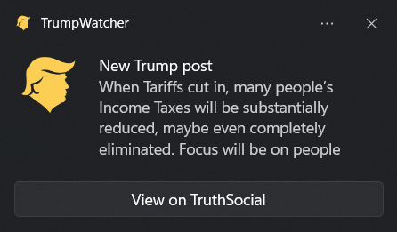

# TrumpWatcher

**TrumpWatcher** is a Windows system tray application that monitors [Truth Social](https://truthsocial.com/) for Donald Trump's latest posts and sends desktop notifications.

It is designed to be a fully self-contained app, bundling its own headless browser internally for reliability.  
No external browsers or configuration are required.

This application is open-source and released under the MIT License.

---

## ✨ Features

- Monitors Trump's official Truth Social posts
- Sends native Windows desktop notifications
- Runs quietly in the system tray
- Auto-detects new posts without manual refresh
- Fully self-contained single EXE file
- Right mouse click menu
- Start Menu link installed automatically
- No Truth Social account required

---

## 💻 Screenshot

---

## 📦 Download

- Latest Release: [Releases Page](https://github.com/Crinklebine/trump_watcher/releases)

> ⚠️ **Important:**  
> On first launch, Windows SmartScreen may show a "Windows protected your PC" warning because the app is unsigned.  
> 
> To run the app:
> 1. Click **More info**.
> 2. Click **Run anyway**.

This is normal for new open-source projects. TrumpWatcher is open-source and you are welcome to review the full source code.

---

## ⚙️ Installation and Use

1. Download `TrumpWatcher-v1.0.x.zip` from the [Releases Page](https://github.com/Crinklebine/trump_watcher/releases).
2. Unzip and locate TrumpWatcher.exe
3. Copy to a convenient location on your computer e.g. C:\Apps\Trumpwatcher
4. Double-click to `TrumpWatcher.exe` to run.
5. TrumpWatcher will appear in your system tray (near the clock or overflow section). An initial notification will always occur after loading.

✅ No installation process — just Unzip, save the EXE to your favorite location and run the EXE

---
## 🗑️ Unintsall

1. Delete TrumpWatcher.exe
2. Delete Start Menu Item:
    1. Press Windows Key + R on your keyboard.
    2. Paste %APPDATA%\Microsoft\Windows\Start Menu\Programs
    3. Press Enter or Click OK
    4. Find TrumpWatcher Start Menu Item and delete manually

👾 No registry entries or configuration files. Only two files need deletion (TrumpWatcher.exe and TrumpWatcher.lnk).

---

## 🦠 Virus Total

TrumpWatcher.exe (v1.0.1) --> SHA-256 38545BFCE012469F7F79AB0A35573FF0FB0A47271CB2D106473A2ED45ED3217C  
Virus Total Link - https://www.virustotal.com/gui/file/38545bfce012469f7f79ab0a35573ff0fb0a47271cb2d106473a2ed45ed3217c

---

##  🧠 Memory Use

TrumpWatcher uses a full headless Chromium browser via Playwright to access content, which results in higher memory usage (~500 MB typical). This ensures compatibility with Truth Social’s dynamic content and media rendering. A future version will transition to using Truth Social’s backend API directly, eliminating the browser entirely and reducing memory usage to under ~100 MB.

Note: On systems with less than 16 GB of RAM, the app may run but could cause slight system slowdown during active monitoring periods.

---

## 🔒 License

This project is licensed under the [MIT License](LICENSE).

You are free to use, modify, and distribute this software.

---

## 🛠️ Development

If you want to build it yourself:

- Python 3.9+
- Install dependencies: `pip install -r requirements.txt`
- Build a Windows EXE using: `python build_app.py` find your EXE in /dist
- `python main.py` currently unsupported due to bound playwright chromium-headless-shell

GitHub Actions are configured to automatically build production ZIP file with version number.

---

## 🙏 Acknowledgements

- [PyInstaller](https://www.pyinstaller.org/) — for building the standalone EXE
- [Playwright](https://playwright.dev/) — for headless browser automation
- [Winotify](https://pypi.org/project/winotify/) — for Windows notifications

---

**🛡️ Disclaimer:**  
This software is provided under the MIT License, without warranty of any kind. Use at your own risk.  
This project is an independent open-source tool and is not affiliated with, endorsed by, or associated with Truth Social, Donald J. Trump, or any related entities. All trademarks and platform names mentioned are the property of their respective owners. This software is provided for educational and informational purposes only.
